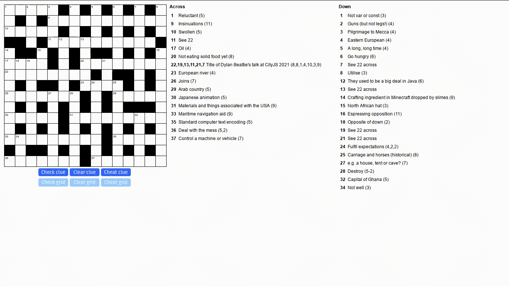

# ipuzzler

A JavaScript client and game grid for ipuz format crossword puzzles.

Find out more on the [iPuzzler website](https://dylanbeattie.github.io/ipuzzler/)

## Installation

To use this for your puzzle follow these instructions:

1. Download the [latest release](https://github.com/dylanbeattie/ipuzzler/releases/latest). v0.1.15 at the time of writing.
2. Save it somewhere on your website. These instructions assume you’ve saved it into /js/.
3. Add `` to the `<head>` of your page.
4. Publish your crossword puzzle in [iPuz format](http://www.ipuz.org/). Say, as  `my-puzzle.ipuz`.
5. Add `<ipuzzler-puzzle src="my-puzzle.ipuz"></ipuzzler-puzzle>` to your page.

Enjoy!

## Local development

So you want to contribute? Great!

Here's how to get a local setup running:

1. Clone the repo: `git clone https://github.com/dylanbeattie/ipuzzler.git`.
2. Switch into it: `cd ipuzzler`.
3. Install dependencies: `npm install`.
4. Start a dev server: `npm start`.
5. Open the site in web browser: `http://localhost:8080/show-puzzle.html?ipuz=/puzzles/homepage.ipuz`.
6. Find all puzzles [in `/github/puzzles/`](https://github.com/dylanbeattie/ipuzzler/tree/main/gh-pages/puzzles).
7. Edit files in `/src` and see the changes updated live.

Looking forward to what you come up with :)

## License

MIT license.

## About iPuz

**ipuz** is "the free, open, extensible standard format for all types of what have traditionally been called 'pencil and paper' puzzles."

The ipuz format is documented at [http://www.ipuz.org/](http://www.ipuz.org/)
